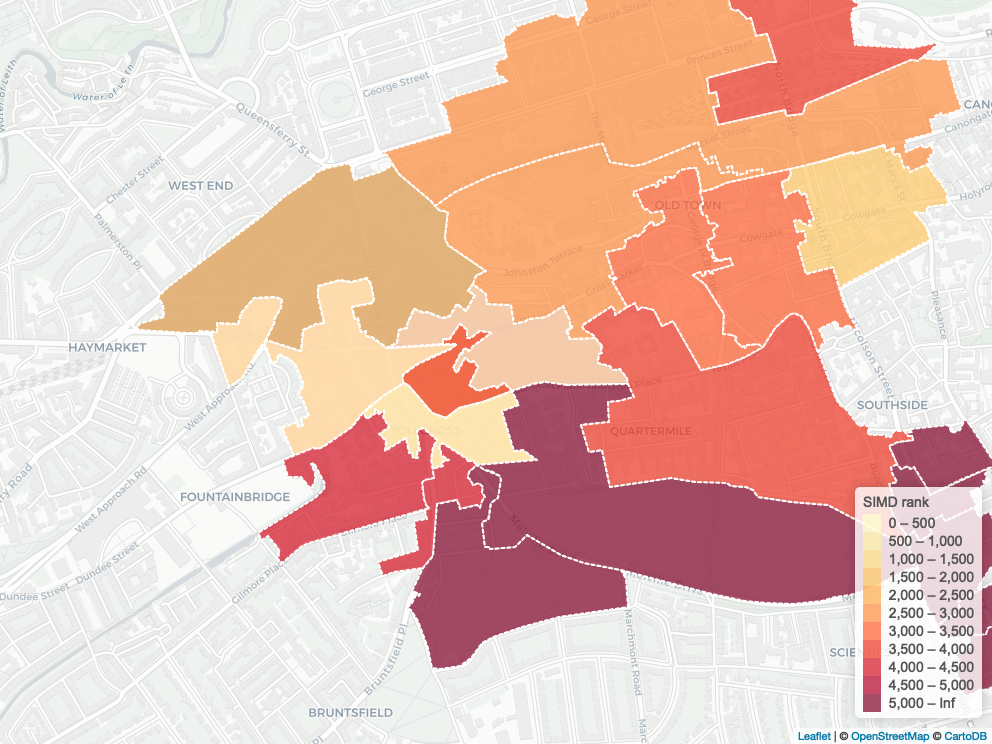
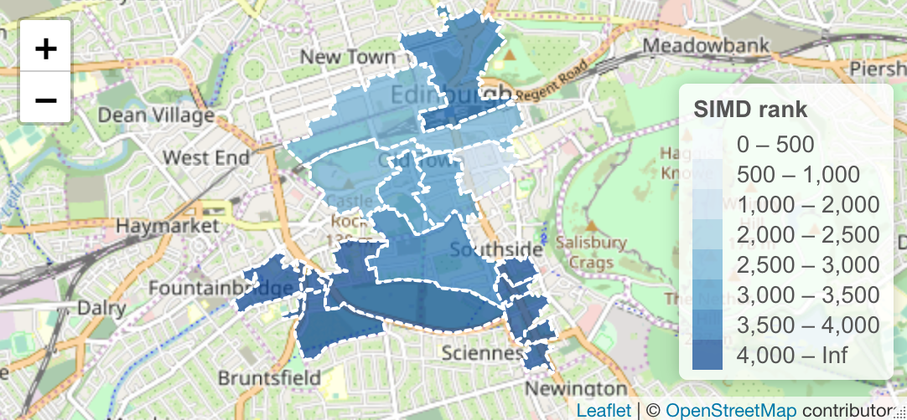

# Custom-Geog-Maps-R
A guide for analysts to quickly create customised maps in pdf or png format without requiring licensed mapping software. 

Author: Richard Haigh

Date of Intial Upload: 1/11/2019

Written - R Desktop 3.5.2

Environment: RStudio v1.2.1335

Software Requirements: PhantomJS (available at https://phantomjs.org) - *optional

Packages:
SPARQL v1.16, tidyverse v1.2.1, leaflet v2.0.2, rgdal v1,4-6, mapview v2.7.0, webshot v0.5.1

This is intended to be a guide for analysts and statisticians with a mid-level knowledge of R and programming fundamentals
that will aid them in creating customised maps. Use this if you wish for a pdf or png output file that shows your desired 
geography level breakdown (be it LA, DZ or SPC) and can shade each geog area by a given variable such as population, wealth 
or any other quantifiable numeric measurement. 

You can use this with an existing dataset providing it has a breakdown of your chosen geography level. You must also have access to the software stated above. 

Using this guide, you can quickly create ouptut such as this without using any licensed mapping software, such as QGIS or Arc:

# Customising Output Further

You can edit the background tiles by altering your argument to the addProviderTiles() function within the larger leaflet function. A full list of available background tiles can be found at: http://leaflet-extras.github.io/leaflet-providers/preview/index.html

For example, say we wanted to use the openStreetMaps background tiles, the code would change to addProviderTiles(provider$openStreetMap). 

The colour palette used for your polygon shading by bin can be one of many options found at the R colour brewer guide: https://www.nceas.ucsb.edu/~frazier/RSpatialGuides/colorPaletteCheatsheet.pdf. Note that your chosen palette must have the same number of desired bins or it will run out of shades! So if we wanted to use shades of blue, we would change our code to pal <- colorBin("blues", domain = dz_merged$SIMDrank, bins = bins)

How would our output look with these changes to our code? 

